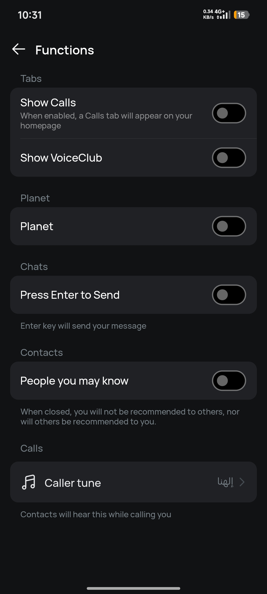

# Delete existing friends

1.  **Open the imo app** and tap the **Contacts** tab (bottom-right on iOS, top-right on Android).
    
2.  **Select the contact** you want to remove to open the chat window.
    
3.  Tap the **person's name** at the top of the screen to open their profile.
    
4.  Tap **Delete** or **Delete contact** (usually at the bottom).
    
5.  Confirm by tapping **Yes**.

# Security & Privacy
 - Enable privacy mode for -
   - Chat & Call Privacy to prevent screenshots or screen recordings on your calls.
   - Contact Privacy so that others can only add you by phone number after you've accepted their requests.
   - Profile Privacy to prevent screenshots or screen recordings on your profile.

 

# Functions
 - Go to Settings > Functions
 - Disable -
   - Show Calls
   - Show VoiceClub
   - Planet
   - People you may know
 

 

